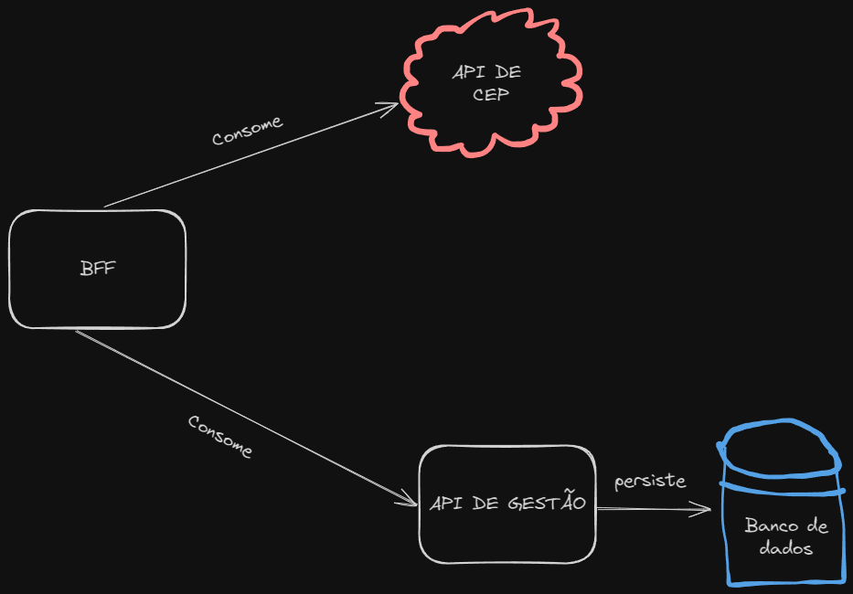

# Minha API

Está API é um BFF e fornece métodos para interagir com o endereço de um usuário.

---
## Como executar 


Após instalar o docker, execute o comando abaixo para criar a imagem do container:

```bash
docker build -t bff .
```

Após criar a imagem, execute o comando abaixo para criar o container:

```bash
docker run --name bff -p 5001:5001 bff
```

## Arquitetura

